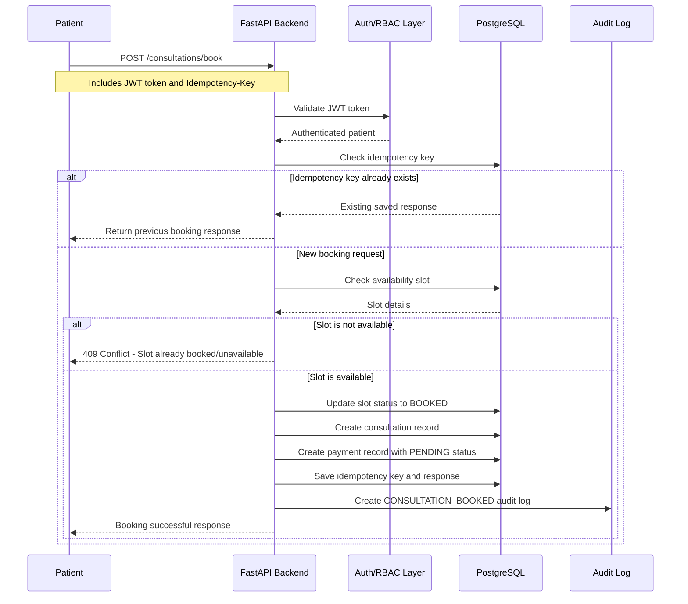
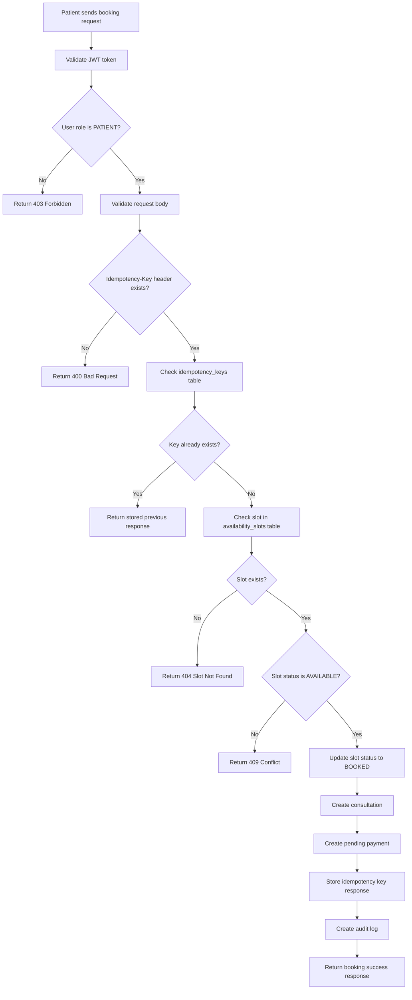
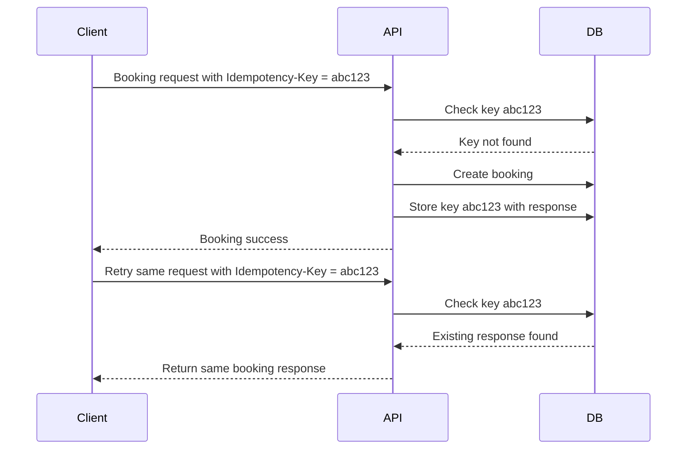
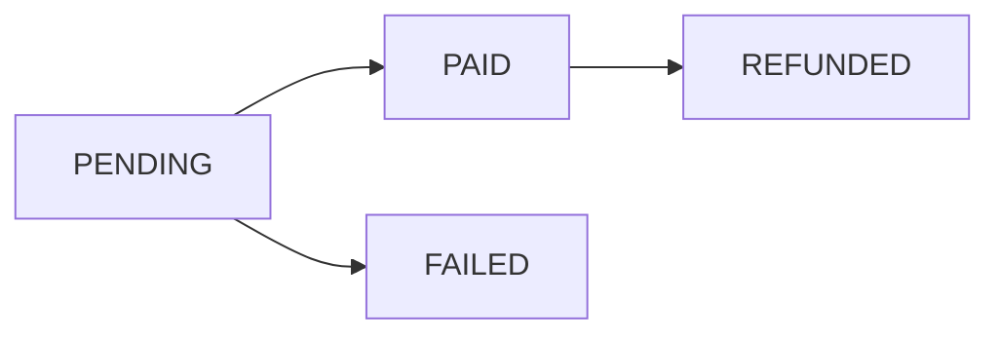
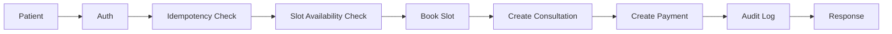

# Booking Sequence Diagram: Amrutam Telemedicine Backend

This document explains the consultation booking workflow in the Amrutam Telemedicine Backend.

The booking flow is one of the most critical workflows because it must ensure:

* A patient can book only an available doctor slot.
* The same slot cannot be booked twice.
* Duplicate retry requests do not create duplicate consultations.
* A payment record is created with the consultation.
* Audit logs are created for traceability and compliance.

---

## 1. Booking Flow Overview

The booking flow starts when a patient sends a request to book a doctor’s available slot.

The request includes:

* Patient JWT token
* Doctor ID
* Slot ID
* Consultation reason
* `Idempotency-Key` header

The `Idempotency-Key` is important because booking is a write operation. If the client retries the same request due to a timeout or network issue, the backend should return the same response instead of creating a duplicate booking.

---

## 2. High-Level Booking Sequence



---

## 3. Detailed Booking Flow



---

## 4. API Request

Endpoint:

```http
POST /consultations/book
```

Required headers:

```http
Authorization: Bearer <patient_access_token>
Idempotency-Key: booking-unique-key-001
```

Example request body:

```json
{
  "doctor_id": 1,
  "slot_id": 5,
  "reason": "Fever and body pain"
}
```

---

## 5. Successful Response

Example response:

```json
{
  "id": 10,
  "patient_id": 2,
  "doctor_id": 1,
  "slot_id": 5,
  "status": "BOOKED",
  "reason": "Fever and body pain",
  "started_at": null,
  "completed_at": null,
  "cancelled_at": null
}
```

---

## 6. Error Responses

### 6.1 Missing Idempotency Key

If the request does not include an `Idempotency-Key`, the API should reject the request.

```json
{
  "detail": "Idempotency-Key header is required"
}
```

### 6.2 Slot Not Found

If the slot ID does not exist:

```json
{
  "detail": "Slot not found"
}
```

### 6.3 Slot Already Booked

If the slot is already booked:

```json
{
  "detail": "Slot is not available"
}
```

### 6.4 Unauthorized User

If the user is not logged in:

```json
{
  "detail": "Not authenticated"
}
```

### 6.5 Forbidden Role

If a doctor or admin tries to book as a patient:

```json
{
  "detail": "You do not have permission to access this resource"
}
```

---

## 7. Tables Involved

| Table                | Purpose in Booking                   |
| -------------------- | ------------------------------------ |
| `users`              | Identifies the authenticated patient |
| `doctors`            | Identifies the doctor being booked   |
| `availability_slots` | Checks and updates slot availability |
| `consultations`      | Stores the consultation booking      |
| `payments`           | Creates pending payment record       |
| `idempotency_keys`   | Prevents duplicate booking writes    |
| `audit_logs`         | Stores booking event for compliance  |

---

## 8. Idempotency Design

Booking is protected using an `Idempotency-Key`.

### Why Idempotency Is Needed

Without idempotency, duplicate bookings can happen when:

* User double-clicks the booking button.
* Client retries after timeout.
* Network fails after backend creates booking.
* Payment/booking request is submitted multiple times.

### How It Works



This makes booking safe for retries.

---

## 9. Double Booking Prevention

Double booking means two patients book the same doctor slot.

The system prevents this by:

1. Checking slot status before booking.
2. Updating the slot status to `BOOKED`.
3. Creating only one consultation for one slot.
4. Returning conflict if another request tries to book the same slot.

Slot status transition:

```text
AVAILABLE → BOOKED
```

Recommended production-level protection:

```sql
CREATE UNIQUE INDEX idx_consultations_slot_id ON consultations(slot_id);
```

This guarantees at database level that one slot cannot have multiple consultations.

---

## 10. Transaction Boundary

The booking workflow should run inside one short database transaction.

Transaction steps:

```text
1. Check idempotency key.
2. Check slot availability.
3. Update slot status to BOOKED.
4. Create consultation.
5. Create payment record.
6. Store idempotency key response.
7. Create audit log.
8. Commit transaction.
```

If any step fails, the transaction should roll back.

This prevents partial booking data such as:

* Slot booked but no consultation created.
* Consultation created but no payment record.
* Payment created but no audit log.
* Duplicate consultation for same slot.

---

## 11. Payment Creation During Booking

When booking succeeds, the system creates a payment record with status:

```text
PENDING
```

The payment can later be confirmed using the mock payment confirmation endpoint.

Payment status flow:



This design allows the consultation booking and payment lifecycle to be tracked separately.

---

## 12. Audit Logging

After booking succeeds, an audit log is created.

Example audit action:

```text
CONSULTATION_BOOKED
```

Audit log contains:

* User ID
* Action
* Resource type
* Resource ID
* IP address
* User agent
* Timestamp

Audit logging is important for:

* Compliance
* Security investigation
* Admin monitoring
* Debugging booking disputes
* Tracking sensitive healthcare workflows

---

## 13. Concurrency Handling

In production, two requests may try to book the same slot at the same time.

Recommended protection layers:

| Layer                | Protection                                 |
| -------------------- | ------------------------------------------ |
| Application layer    | Check slot status before booking           |
| Database transaction | Keep booking update atomic                 |
| Row-level lock       | Lock selected slot row during booking      |
| Unique index         | Ensure one consultation per slot           |
| Idempotency key      | Prevent duplicate retries from same client |

Example production logic:

```text
SELECT slot
WHERE slot_id = requested_slot_id
FOR UPDATE;
```

This locks the slot row during the transaction so another request cannot update it at the same time.

---

## 14. Retry and Backoff

Booking requests should not be blindly retried without idempotency.

Recommended client retry strategy:

```text
Retry only if network timeout or 5xx error occurs.
Use the same Idempotency-Key for retry.
Use exponential backoff.
Maximum retries: 3.
```

Suggested backoff:

```text
Attempt 1: immediate
Attempt 2: after 200ms
Attempt 3: after 400ms
Attempt 4: after 800ms
```

The client should not retry for:

* `400 Bad Request`
* `401 Unauthorized`
* `403 Forbidden`
* `404 Slot Not Found`
* `409 Slot Already Booked`
* `422 Validation Error`

---

## 15. Booking Workflow Summary



The booking workflow is designed to be:

* Secure
* Idempotent
* Transaction-safe
* Auditable
* Protected against double booking
* Ready for production-level concurrency improvements

---

## 16. Conclusion

The consultation booking flow is the core workflow of the Amrutam Telemedicine Backend.

It uses authentication, RBAC, request validation, idempotency keys, slot status checks, consultation creation, payment creation, and audit logging to create a safe and reliable booking experience.

This design ensures that the backend can handle real-world booking problems such as duplicate retries, double booking, payment tracking, and compliance audit requirements.
