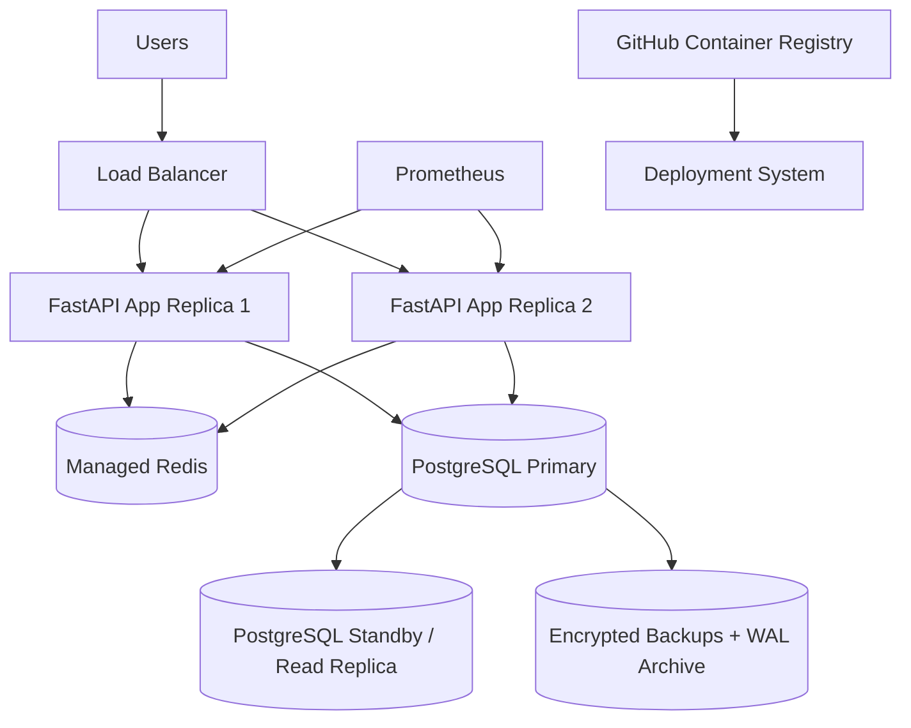

# Disaster Recovery Plan: Amrutam Telemedicine Backend

This document explains the disaster recovery and backup strategy for the Amrutam Telemedicine Backend.

Disaster recovery is important because the backend handles sensitive and business-critical workflows such as user authentication, doctor availability, consultation booking, prescriptions, payments, and audit logs.

The goal is to ensure that the system can recover from failures with minimum data loss and minimum downtime.

---

## 1. Disaster Recovery Goals

The main goals are:

1. Protect patient, doctor, consultation, prescription, payment, and audit data.
2. Recover quickly from database failure.
3. Restore service after application/container failure.
4. Reduce data loss during incidents.
5. Maintain auditability after recovery.
6. Ensure the backend can be redeployed from source code and Docker image.
7. Provide clear recovery steps for production operations.

---

## 2. Recovery Targets

| Metric                 | Target                                                    |
| ---------------------- | --------------------------------------------------------- |
| RPO                    | 15 minutes                                                |
| RTO                    | 1 hour                                                    |
| Availability target    | 99.95%                                                    |
| Backup retention       | 30–90 days                                                |
| Critical data priority | Users, consultations, prescriptions, payments, audit logs |

### RPO

**Recovery Point Objective** defines the maximum acceptable data loss.

For this backend:

```text id="90w3hq"
RPO = 15 minutes
```

This means the system should be able to recover data up to a point no older than 15 minutes before failure.

### RTO

**Recovery Time Objective** defines the maximum acceptable downtime.

For this backend:

```text id="b3iepp"
RTO = 1 hour
```

This means the system should be restored within 1 hour after a serious failure.

---

## 3. Critical Components

| Component                 | Purpose                    | Recovery Priority |
| ------------------------- | -------------------------- | ----------------- |
| PostgreSQL                | Main system of record      | Critical          |
| FastAPI app               | Backend API service        | Critical          |
| Redis                     | Cache and rate-limit store | Medium            |
| Prometheus                | Metrics monitoring         | Medium            |
| GitHub repository         | Source code and infra      | Critical          |
| GitHub Container Registry | Published Docker image     | High              |
| Environment variables     | Secrets and config         | Critical          |
| Audit logs                | Compliance traceability    | Critical          |

---

## 4. Data Backup Strategy

PostgreSQL is the most important component to back up because it stores the system of record.

Important tables:

```text id="7akzgt"
users
profiles
doctors
availability_slots
consultations
prescriptions
payments
audit_logs
idempotency_keys
```

Recommended backup types:

| Backup Type          | Frequency     | Purpose                     |
| -------------------- | ------------- | --------------------------- |
| Full database backup | Daily         | Complete database recovery  |
| WAL archiving        | Continuous    | Point-in-time recovery      |
| Schema backup        | Every release | Restore database structure  |
| Configuration backup | Every release | Restore deployment config   |
| Docker image backup  | Every release | Redeploy stable app version |

---

## 5. PostgreSQL Backup

### 5.1 Manual Backup Command

For local or demo environment:

```bash id="9h4vaq"
docker exec amrutam_postgres pg_dump -U postgres amrutam_db > backup_amrutam_db.sql
```

### 5.2 Restore Command

```bash id="xdsdor"
docker exec -i amrutam_postgres psql -U postgres amrutam_db < backup_amrutam_db.sql
```

### 5.3 Production Backup Recommendation

For production, use:

```text id="wqepzo"
Daily full backups
Continuous WAL archiving
Encrypted backup storage
Backup restore testing
Automated backup monitoring
```

Recommended managed database options:

```text id="lhm2ut"
AWS RDS PostgreSQL
Google Cloud SQL PostgreSQL
Azure Database for PostgreSQL
Neon / Supabase / Railway PostgreSQL for smaller deployments
```

---

## 6. Point-in-Time Recovery

Point-in-Time Recovery allows restoring the database to a specific time before failure.

This is useful when:

* A bad deployment corrupts data.
* A user accidentally deletes important records.
* A malicious request modifies data.
* A migration fails.
* A partial outage causes inconsistent records.

Recommended configuration:

```text id="0u53x0"
Enable WAL archiving
Store WAL logs in encrypted object storage
Retain WAL logs for 7–30 days
Test PITR regularly
```

Example target:

```text id="ar9gk5"
Restore database to 2026-07-11 15:30:00 IST
```

---

## 7. Redis Recovery

Redis is used for:

1. Doctor search caching
2. Rate-limit counters

Redis is not the main system of record.

If Redis fails:

* Doctor search cache is lost.
* Rate-limit counters reset.
* Backend can continue if fallback mode is enabled.
* PostgreSQL data remains safe.

Recovery steps:

```text id="syxwc4"
1. Restart Redis container/service.
2. Verify Redis health.
3. Check /health/redis endpoint.
4. Confirm doctor search still works.
5. Confirm login/register/booking rate limits work.
```

Docker command:

```bash id="5ui3k6"
docker restart amrutam_redis
```

Verify:

```bash id="ev9kka"
curl http://127.0.0.1:8000/health/redis
```

Production recommendation:

```text id="gid0na"
Use managed Redis with monitoring, memory limits, and alerting.
```

---

## 8. Application Recovery

The FastAPI application is stateless. This makes recovery easier.

If the app container crashes:

```bash id="aulb4w"
docker restart amrutam_api
```

If the image needs to be rebuilt:

```bash id="x3q0kd"
docker compose up --build
```

If using the published Docker image:

```bash id="59r6fb"
docker pull ghcr.io/chauhanmuskan291980-wq/amrutam-telemedicine-backend:latest
```

Then redeploy the container with the correct environment variables.

Because the app is stateless, no business data is lost when the app container restarts.

---

## 9. Docker Compose Recovery

If the full local Docker Compose stack stops, restart it using:

```bash id="jqaqti"
docker compose up -d --build
```

Check containers:

```bash id="9kttb6"
docker ps
```

Expected containers:

```text id="7nt8ij"
amrutam_api
amrutam_postgres
amrutam_redis
amrutam_prometheus
```

Stop safely:

```bash id="5nlra0"
docker compose down
```

Important:

```bash id="f3ljnv"
docker compose down -v
```

should be used carefully because `-v` removes Docker volumes and can delete PostgreSQL data in local development.

---

## 10. Monitoring During Recovery

After any recovery action, verify these endpoints:

| Endpoint        | Expected Result                             |
| --------------- | ------------------------------------------- |
| `/health`       | Backend is running                          |
| `/ready`        | Backend is ready                            |
| `/health/redis` | Redis is healthy or fallback mode is active |
| `/metrics`      | Metrics are exposed                         |
| `/docs`         | API documentation loads                     |

Commands:

```bash id="9eqla3"
curl http://127.0.0.1:8000/health
curl http://127.0.0.1:8000/ready
curl http://127.0.0.1:8000/health/redis
curl http://127.0.0.1:8000/metrics
```

Prometheus UI:

```text id="fefabg"
http://127.0.0.1:9090
```

In Prometheus:

```text id="9h0pov"
Status → Targets → amrutam-api should be UP
```

---

## 11. Failure Scenarios and Recovery Steps

## 11.1 FastAPI Container Failure

### Symptoms

```text id="4f5wah"
http://127.0.0.1:8000/health fails
amrutam_api container exited
```

### Recovery

```bash id="r1c8im"
docker restart amrutam_api
```

If restart fails:

```bash id="0hqabo"
docker compose up --build
```

### Verification

```bash id="2oow7z"
curl http://127.0.0.1:8000/health
```

---

## 11.2 PostgreSQL Container Failure

### Symptoms

```text id="4o77gx"
API returns database connection errors
/readiness check fails
amrutam_postgres is unhealthy or stopped
```

### Recovery

```bash id="yq783s"
docker restart amrutam_postgres
```

If data is corrupted, restore from backup:

```bash id="4r8916"
docker exec -i amrutam_postgres psql -U postgres amrutam_db < backup_amrutam_db.sql
```

### Verification

```bash id="cuu100"
docker ps
curl http://127.0.0.1:8000/ready
```

---

## 11.3 Redis Failure

### Symptoms

```text id="b733qk"
/health/redis shows unavailable
rate limiting or cache may not work correctly
```

### Recovery

```bash id="ex9ncx"
docker restart amrutam_redis
```

### Verification

```bash id="1cjgb8"
curl http://127.0.0.1:8000/health/redis
```

---

## 11.4 Prometheus Failure

### Symptoms

```text id="vq5puj"
http://127.0.0.1:9090 does not open
Metrics are not visible in Prometheus UI
```

### Recovery

```bash id="k8cp7h"
docker restart amrutam_prometheus
```

### Verification

```text id="j7lv9p"
Open http://127.0.0.1:9090
Check Status → Targets
```

---

## 11.5 Bad Deployment

### Symptoms

```text id="ekg81a"
New version crashes
CI was bypassed or runtime config is wrong
Health endpoint fails
```

### Recovery

1. Roll back to previous Git commit.
2. Redeploy previous Docker image.
3. Restore database only if data migration caused corruption.
4. Verify health endpoints.
5. Review logs and audit events.

Recommended production strategy:

```text id="kz64lw"
Blue-green deployment
Canary deployment
Versioned Docker images
Database migration rollback plan
```

---

## 11.6 Accidental Data Deletion

### Symptoms

```text id="0hfjzy"
Important rows deleted from users, consultations, prescriptions, or payments
```

### Recovery

1. Stop write traffic if needed.
2. Identify deletion time.
3. Restore database to a temporary recovery database.
4. Export missing records.
5. Carefully re-import recovered records.
6. Verify relationships and audit logs.

Production recommendation:

```text id="hy9yu7"
Use point-in-time recovery and append-only audit logs.
```

---

## 11.7 Security Incident

### Possible Incidents

```text id="5ujmej"
JWT secret leak
Database credential leak
Suspicious admin access
Patient data access violation
High login failure spike
```

### Recovery Steps

1. Rotate affected secrets.
2. Revoke active sessions if supported.
3. Review audit logs.
4. Check access patterns.
5. Patch vulnerability.
6. Redeploy application.
7. Notify affected stakeholders if required.
8. Create incident report.

Recommended production controls:

```text id="fpvgwi"
Secret manager
MFA
Centralized logging
Alerting
Audit retention
Access review
```

---

## 12. Backup Retention Policy

Recommended retention:

| Backup Type            | Retention                     |
| ---------------------- | ----------------------------- |
| Daily database backups | 30 days                       |
| Weekly backups         | 90 days                       |
| Monthly backups        | 1 year                        |
| WAL logs               | 7–30 days                     |
| Docker images          | Last 5–10 stable versions     |
| Audit logs             | 1–7 years depending on policy |

---

## 13. Backup Security

Backups must be protected because they contain sensitive data.

Recommended controls:

| Control               | Purpose                              |
| --------------------- | ------------------------------------ |
| Encryption at rest    | Protect backup files                 |
| Encryption in transit | Protect backup transfer              |
| Access control        | Restrict who can restore/download    |
| Separate storage      | Protect from same-system failure     |
| Restore testing       | Ensure backups are usable            |
| Retention policy      | Avoid unnecessary long-term exposure |

---

## 14. Restore Testing

Backups are only useful if they can be restored.

Recommended restore test schedule:

| Test                                    | Frequency      |
| --------------------------------------- | -------------- |
| Restore latest backup to test database  | Monthly        |
| Verify schema and row counts            | Monthly        |
| Verify critical workflows after restore | Monthly        |
| Test point-in-time recovery             | Quarterly      |
| Disaster recovery drill                 | Twice per year |

Critical workflows to test after restore:

```text id="qi9hfz"
Register/login
Doctor search
Doctor availability
Consultation booking
Prescription creation
Payment confirmation
Admin analytics
Audit log access
```

---

## 15. Deployment Recovery from GitHub

The project can be recovered using GitHub source code.

Steps:

```bash id="9w6w80"
git clone https://github.com/chauhanmuskan291980-wq/amrutam-telemedicine-backend.git
cd amrutam-telemedicine-backend
docker compose up --build
```

The published Docker image can also be pulled:

```bash id="mm8lqr"
docker pull ghcr.io/chauhanmuskan291980-wq/amrutam-telemedicine-backend:latest
```

This means the source code and deployable container image are both available for recovery.

---

## 16. CI/CD Recovery

If a bad commit causes pipeline failure:

1. Check GitHub Actions logs.
2. Fix failing tests/lint/security issue.
3. Commit the fix.
4. Push again.
5. Confirm green CI checkmark.

If Docker publish fails:

1. Check Docker publish workflow logs.
2. Confirm GitHub package permissions.
3. Confirm Dockerfile builds locally.
4. Push fix.
5. Confirm image appears in GitHub Packages.

---

## 17. Production Disaster Recovery Architecture

Recommended production architecture:



This architecture supports:

* Multiple API replicas
* Database failover
* Encrypted backups
* Redis reliability
* Metrics and alerts
* Re-deployment from Docker images

---

## 18. Disaster Recovery Runbook

### Step 1: Identify Failure

Check:

```bash id="weyuvr"
docker ps
docker logs amrutam_api
docker logs amrutam_postgres
docker logs amrutam_redis
```

Check endpoints:

```bash id="rqdhpp"
curl http://127.0.0.1:8000/health
curl http://127.0.0.1:8000/ready
curl http://127.0.0.1:8000/health/redis
```

### Step 2: Stop Bad Traffic or Bad Deployment

If needed:

```bash id="525dpx"
docker compose down
```

### Step 3: Restore Service

```bash id="3ts7c3"
docker compose up -d --build
```

### Step 4: Restore Database if Required

```bash id="68jq7v"
docker exec -i amrutam_postgres psql -U postgres amrutam_db < backup_amrutam_db.sql
```

### Step 5: Verify Critical Workflows

Check:

```text id="2hx6ql"
Login
Doctor search
Booking
Payment
Prescription
Admin analytics
Audit logs
```

### Step 6: Review Logs and Metrics

Check:

```text id="b3915d"
Docker logs
Prometheus targets
Prometheus request/error metrics
Audit logs
```

### Step 7: Document Incident

Incident report should include:

```text id="ydzvne"
Incident time
Root cause
Affected services
Data loss, if any
Recovery steps
Prevention steps
Owner
Follow-up tasks
```

---

## 19. Current Assignment-Level Status

| Area                    | Status      |
| ----------------------- | ----------- |
| Dockerized app          | Implemented |
| PostgreSQL container    | Implemented |
| Redis container         | Implemented |
| Prometheus container    | Implemented |
| Health checks           | Implemented |
| Metrics endpoint        | Implemented |
| CI tests                | Implemented |
| Security scan           | Implemented |
| Docker image publishing | Implemented |
| Manual backup commands  | Documented  |
| Production PITR         | Recommended |
| Managed DB failover     | Recommended |
| Encrypted backups       | Recommended |
| Restore drills          | Recommended |

---

## 20. Conclusion

The Amrutam Telemedicine Backend can recover from local container failures using Docker Compose and can be redeployed from GitHub source code or the published GitHub Container Registry image.

For production, the most important disaster recovery controls are PostgreSQL backups, point-in-time recovery, encrypted backup storage, database failover, Docker image versioning, health checks, Prometheus monitoring, and regular restore testing.

This disaster recovery plan ensures that the backend is prepared for common failure scenarios while keeping patient, doctor, consultation, prescription, payment, and audit data protected.
