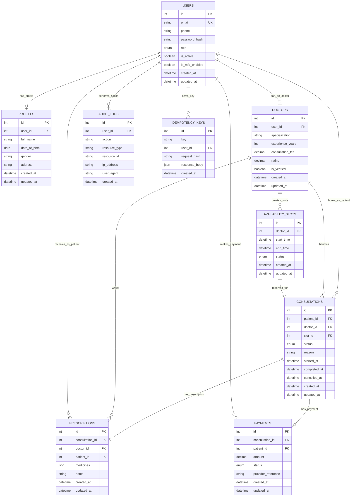
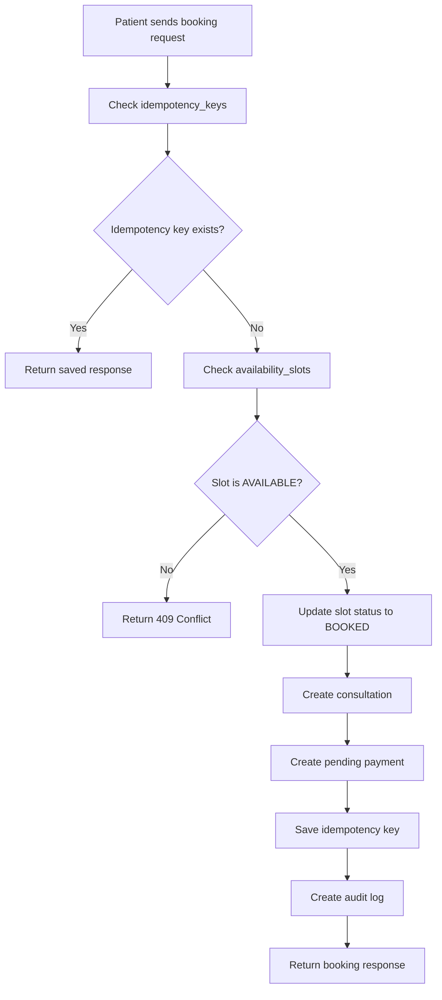
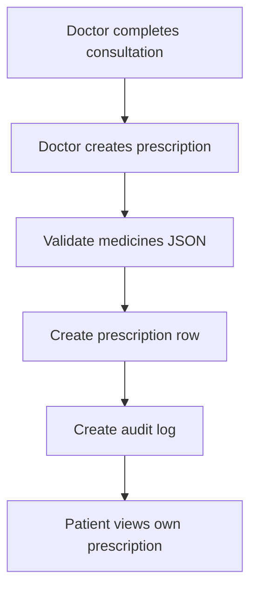

# Entity Relationship Diagram: Amrutam Telemedicine Backend

An **Entity Relationship Diagram (ERD)** is a visual blueprint that illustrates how data entities relate to each other within a system or database.

For the Amrutam Telemedicine Backend, the ERD shows how users, doctors, availability slots, consultations, prescriptions, payments, audit logs, and idempotency keys are connected.

This database design supports the core workflows required in the assignment:

* User lifecycle
* Doctor availability
* Consultation booking
* Prescription management
* Payment tracking
* Audit logging
* Admin analytics
* Idempotent booking writes

---

## 1. ER Diagram



---

## 2. Entity Explanation

### 2.1 users

The `users` table stores authentication and account-level information.

It contains:

* Email
* Phone
* Password hash
* Role
* Active status
* MFA enabled flag
* Created and updated timestamps

Supported roles:

```text
PATIENT
DOCTOR
ADMIN
```

This table is central to the system because patients, doctors, and admins are all users with different permissions.

---

### 2.2 profiles

The `profiles` table stores personal profile information for a user.

It is separated from the `users` table to keep authentication data and personal profile data isolated.

Relationship:

```text
One user can have one profile.
```

---

### 2.3 doctors

The `doctors` table stores doctor-specific information.

It contains:

* Specialization
* Experience years
* Consultation fee
* Rating
* Verification status

Relationship:

```text
One user can have one doctor profile.
```

Only users with the `DOCTOR` role should have a related doctor record.

---

### 2.4 availability_slots

The `availability_slots` table stores time slots created by doctors.

Each slot belongs to one doctor.

Slot statuses:

```text
AVAILABLE
BOOKED
CANCELLED
```

This table is important for the booking workflow because patients can only book slots that are currently available.

---

### 2.5 consultations

The `consultations` table stores consultation booking and lifecycle information.

A consultation connects:

* One patient
* One doctor
* One availability slot

Consultation statuses:

```text
BOOKED
ONGOING
COMPLETED
CANCELLED
```

Important rule:

```text
One availability slot should be connected to only one consultation.
```

This helps prevent double booking.

---

### 2.6 prescriptions

The `prescriptions` table stores medicines and doctor notes for a consultation.

Each prescription belongs to:

* One consultation
* One doctor
* One patient

The `medicines` field is stored as JSON because one prescription can contain multiple medicines.

Example:

```json
[
  {
    "name": "Paracetamol",
    "dosage": "500mg",
    "frequency": "Twice a day",
    "duration": "3 days",
    "instructions": "After food"
  }
]
```

---

### 2.7 payments

The `payments` table tracks payment information for consultations.

It stores:

* Consultation ID
* Patient ID
* Amount
* Payment status
* Provider reference

Payment statuses:

```text
PENDING
PAID
FAILED
REFUNDED
```

The current implementation uses a mock payment confirmation flow. In production, this table can connect with a real payment gateway.

---

### 2.8 audit_logs

The `audit_logs` table stores security and compliance-related events.

It records:

* User ID
* Action
* Resource type
* Resource ID
* IP address
* User agent
* Timestamp

Examples of audit actions:

```text
USER_REGISTERED
DOCTOR_SLOT_CREATED
CONSULTATION_BOOKED
CONSULTATION_STARTED
CONSULTATION_COMPLETED
PRESCRIPTION_CREATED
PAYMENT_CONFIRMED
```

Audit logs are important for:

* Compliance
* Security review
* Debugging
* Incident investigation
* Admin monitoring

---

### 2.9 idempotency_keys

The `idempotency_keys` table prevents duplicate booking writes.

It stores:

* Idempotency key
* User ID
* Request hash
* Saved response body
* Created timestamp

This table is used in the booking API.

When a patient retries the same booking request with the same `Idempotency-Key`, the system returns the existing response instead of creating another consultation.

This protects the system from:

* Double clicks
* Client retries
* Network timeouts
* Duplicate booking attempts

---

## 3. Relationship Summary

| Relationship                         | Type                | Description                                 |
| ------------------------------------ | ------------------- | ------------------------------------------- |
| `users → profiles`                   | One-to-one          | A user can have one profile                 |
| `users → doctors`                    | One-to-one optional | A doctor user has one doctor profile        |
| `doctors → availability_slots`       | One-to-many         | A doctor can create many availability slots |
| `users → consultations`              | One-to-many         | A patient can book many consultations       |
| `doctors → consultations`            | One-to-many         | A doctor can handle many consultations      |
| `availability_slots → consultations` | One-to-one optional | A booked slot creates one consultation      |
| `consultations → prescriptions`      | One-to-one optional | A consultation can have one prescription    |
| `consultations → payments`           | One-to-one optional | A consultation can have one payment         |
| `users → audit_logs`                 | One-to-many         | A user can trigger many audit events        |
| `users → idempotency_keys`           | One-to-many         | A user can create many idempotent requests  |

---

## 4. Booking Flow Through Database Tables



Tables involved in booking:

```text
availability_slots
consultations
payments
idempotency_keys
audit_logs
```

This flow ensures that booking is consistent, traceable, and safe from duplicate writes.

---

## 5. Prescription Flow Through Database Tables



Tables involved in prescription flow:

```text
consultations
prescriptions
audit_logs
```

---

## 6. Admin Analytics Data Sources

Admin analytics are generated from aggregate counts across core tables.

| Admin Metric        | Source Table    |
| ------------------- | --------------- |
| Total users         | `users`         |
| Total doctors       | `doctors`       |
| Total consultations | `consultations` |
| Total prescriptions | `prescriptions` |
| Total payments      | `payments`      |

---

## 7. Recommended Indexes

The following indexes are recommended for production performance:

```sql
CREATE INDEX idx_users_email ON users(email);

CREATE INDEX idx_doctors_specialization ON doctors(specialization);
CREATE INDEX idx_doctors_rating ON doctors(rating);

CREATE INDEX idx_availability_doctor_status ON availability_slots(doctor_id, status);
CREATE INDEX idx_availability_start_time ON availability_slots(start_time);

CREATE INDEX idx_consultations_patient_id ON consultations(patient_id);
CREATE INDEX idx_consultations_doctor_id ON consultations(doctor_id);
CREATE UNIQUE INDEX idx_consultations_slot_id ON consultations(slot_id);

CREATE INDEX idx_prescriptions_patient_id ON prescriptions(patient_id);
CREATE INDEX idx_prescriptions_doctor_id ON prescriptions(doctor_id);

CREATE INDEX idx_payments_patient_id ON payments(patient_id);
CREATE INDEX idx_payments_status ON payments(status);

CREATE INDEX idx_audit_logs_user_id ON audit_logs(user_id);
CREATE INDEX idx_audit_logs_created_at ON audit_logs(created_at);

CREATE UNIQUE INDEX idx_idempotency_user_key ON idempotency_keys(user_id, key);
```

---

## 8. Data Integrity Rules

Important data integrity rules:

1. User email must be unique.
2. Passwords must be stored as hashes, never plain text.
3. Admin users cannot self-register.
4. A doctor profile should only belong to a user with the `DOCTOR` role.
5. A patient can only book an available slot.
6. One slot should not create multiple consultations.
7. A prescription should belong to one consultation.
8. A payment should belong to one consultation.
9. Patients should not access other patients’ prescriptions.
10. Audit logs should be append-only.
11. Idempotency keys should be unique per user and key.

---

## 9. Data Classification

| Data Type           | Examples                                   | Classification                      |
| ------------------- | ------------------------------------------ | ----------------------------------- |
| Authentication data | Email, password hash, JWT claims           | Sensitive                           |
| Personal data       | Name, phone, address, date of birth        | Sensitive                           |
| Medical data        | Consultation reason, prescriptions         | Highly sensitive                    |
| Payment data        | Amount, payment status, provider reference | Sensitive                           |
| Audit data          | IP address, user agent, action history     | Sensitive                           |
| Doctor public data  | Specialization, fee, rating                | Internal/public depending on policy |

---

## 10. Partitioning Strategy

For high-scale production usage, partitioning is recommended for high-growth tables.

| Table           | Partition Strategy                     |
| --------------- | -------------------------------------- |
| `audit_logs`    | Monthly partition by `created_at`      |
| `consultations` | Monthly partition by consultation date |
| `payments`      | Monthly partition by payment date      |
| `prescriptions` | Monthly partition by consultation date |

Partitioning improves:

* Query speed
* Backup performance
* Archival
* Compliance retention management

---

## 11. Retention Strategy

Recommended retention policies:

| Table              | Suggested Retention                    |
| ------------------ | -------------------------------------- |
| `audit_logs`       | 1–7 years based on compliance policy   |
| `consultations`    | As required by healthcare/legal policy |
| `prescriptions`    | As required by healthcare/legal policy |
| `payments`         | As required by finance/legal policy    |
| `idempotency_keys` | 24–72 hours                            |

Idempotency keys should be short-lived because they are only needed during the safe retry window.

---

## 12. Conclusion

This ERD supports all major Amrutam backend requirements:

* Secure user lifecycle
* Role-based access
* Doctor availability
* Safe consultation booking
* Prescription management
* Payment tracking
* Audit logging
* Admin analytics
* Idempotent writes

The schema is relational, normalized, scalable, and suitable for a production-grade telemedicine backend.
