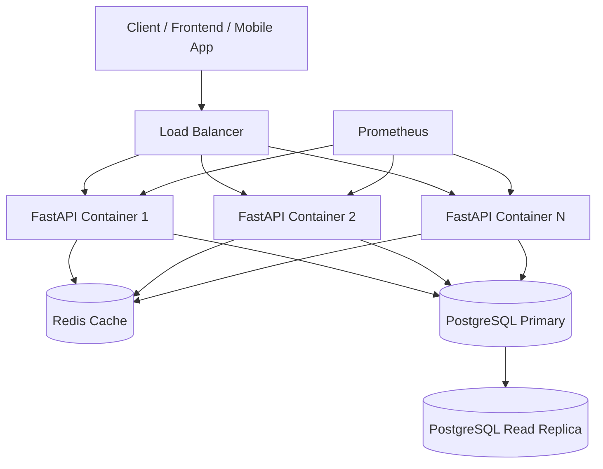
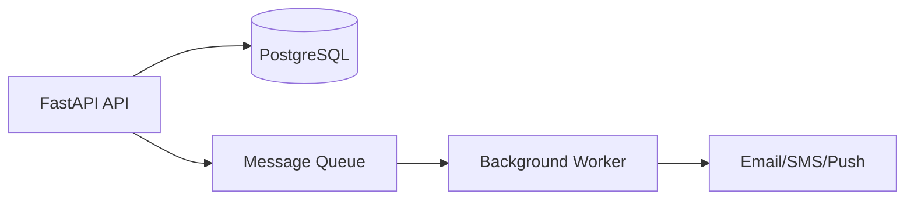

# Scalability Strategy: Amrutam Telemedicine Backend

This document explains how the Amrutam Telemedicine Backend is designed to scale for high traffic, fast response times, reliable booking, and large data growth.

The assignment target is:

| Requirement         | Target                |
| ------------------- | --------------------- |
| Daily consultations | 100k                  |
| Read latency        | p95 < 200ms           |
| Write latency       | p95 < 500ms           |
| Availability        | 99.95%                |
| Security            | Encryption, MFA, RBAC |
| Observability       | Metrics, logs, traces |

---

## 1. Scalability Goals

The main scalability goals are:

1. Handle high consultation booking traffic.
2. Keep doctor search APIs fast.
3. Prevent database overload.
4. Prevent double booking under concurrent requests.
5. Support horizontal scaling of API containers.
6. Keep write transactions short and reliable.
7. Support large audit log and consultation history growth.
8. Maintain observability for performance monitoring.

---

## 2. High-Level Scalable Architecture



The FastAPI application is stateless, so multiple containers can run behind a load balancer.

---

## 3. Application Scalability

The backend is designed as a stateless API service.

This means:

* User session data is not stored inside the app container.
* Authentication is handled through JWT.
* Cache and rate-limit data are stored in Redis.
* Persistent business data is stored in PostgreSQL.

Because of this, the app can be scaled horizontally:

```text id="gm4s7a"
1 FastAPI container → multiple FastAPI containers
```

Recommended production command/example:

```text id="9rr1oz"
Run multiple replicas behind a load balancer.
```

In Kubernetes, this would be handled using deployments and horizontal pod autoscaling.

---

## 4. Read Scalability

Read-heavy APIs include:

* Doctor search
* Doctor slots
* Patient consultations
* Admin analytics
* Audit logs

Read scalability is improved using:

| Strategy              | Purpose                              |
| --------------------- | ------------------------------------ |
| Redis caching         | Reduces repeated database queries    |
| Pagination            | Prevents large unbounded responses   |
| Indexes               | Speeds up database filtering         |
| Read replicas         | Offload read traffic from primary DB |
| Short response models | Reduce payload size                  |

---

## 5. Doctor Search Scalability

Doctor search is a common read operation.

Current optimization:

```text id="uz7log"
Doctor search results are cached using Redis or in-memory fallback.
```

Example cache key:

```text id="6s6lbx"
doctor_search:specialization=<value>:min_rating=<value>:limit=<value>:offset=<value>
```

Cache TTL:

```text id="f7ctrj"
60 seconds
```

Why this helps:

* Reduces repeated PostgreSQL queries.
* Improves p95 read latency.
* Handles repeated searches for common specializations.
* Reduces database load during traffic spikes.

Cache invalidation happens when doctor availability changes.

---

## 6. Write Scalability

Write-heavy workflows include:

* User registration
* Doctor availability creation
* Consultation booking
* Prescription creation
* Payment confirmation
* Audit logging

Write scalability is handled through:

| Strategy               | Purpose                                     |
| ---------------------- | ------------------------------------------- |
| Short transactions     | Reduce lock time                            |
| Idempotency keys       | Prevent duplicate writes                    |
| Slot status validation | Prevent invalid booking                     |
| Database constraints   | Protect data integrity                      |
| Async jobs             | Move non-critical work outside request path |
| Connection pooling     | Manage DB connections efficiently           |

---

## 7. Booking Scalability

Booking is the most critical write workflow.

The booking flow must be:

* Fast
* Transaction-safe
* Idempotent
* Protected from double booking
* Auditable

Current booking design:

```text id="zjslre"
Patient request
→ JWT validation
→ Idempotency key check
→ Slot availability check
→ Slot marked as BOOKED
→ Consultation created
→ Payment created
→ Audit log created
→ Response returned
```

Recommended production protection:

```sql id="pux6ny"
CREATE UNIQUE INDEX idx_consultations_slot_id ON consultations(slot_id);
```

This guarantees at database level that one slot cannot create multiple consultations.

---

## 8. Database Scalability

PostgreSQL is the primary database.

Recommended database scalability strategies:

| Strategy                         | Benefit                         |
| -------------------------------- | ------------------------------- |
| Index frequently queried columns | Faster reads                    |
| Connection pooling               | Better DB connection management |
| Read replicas                    | Scale read traffic              |
| Partitioning                     | Improve large table performance |
| Query optimization               | Reduce slow queries             |
| Archive old records              | Keep active tables smaller      |
| Regular vacuum/analyze           | Maintain DB performance         |

---

## 9. Recommended Indexes

```sql id="oygbtt"
CREATE INDEX idx_users_email ON users(email);

CREATE INDEX idx_doctors_specialization ON doctors(specialization);
CREATE INDEX idx_doctors_rating ON doctors(rating);

CREATE INDEX idx_availability_doctor_status ON availability_slots(doctor_id, status);
CREATE INDEX idx_availability_start_time ON availability_slots(start_time);

CREATE INDEX idx_consultations_patient_id ON consultations(patient_id);
CREATE INDEX idx_consultations_doctor_id ON consultations(doctor_id);
CREATE UNIQUE INDEX idx_consultations_slot_id ON consultations(slot_id);

CREATE INDEX idx_prescriptions_patient_id ON prescriptions(patient_id);
CREATE INDEX idx_prescriptions_doctor_id ON prescriptions(doctor_id);

CREATE INDEX idx_payments_patient_id ON payments(patient_id);
CREATE INDEX idx_payments_status ON payments(status);

CREATE INDEX idx_audit_logs_user_id ON audit_logs(user_id);
CREATE INDEX idx_audit_logs_created_at ON audit_logs(created_at);

CREATE UNIQUE INDEX idx_idempotency_user_key ON idempotency_keys(user_id, key);
```

These indexes support common query patterns such as:

* Login by email
* Search doctors by specialization
* Find available slots by doctor
* Fetch consultations by patient/doctor
* Fetch prescriptions by patient/doctor
* Fetch audit logs by time/user
* Prevent duplicate idempotency keys

---

## 10. Partitioning Strategy

Large tables can grow quickly in a telemedicine system.

Recommended partitioning:

| Table           | Partition Strategy                     |
| --------------- | -------------------------------------- |
| `audit_logs`    | Monthly partition by `created_at`      |
| `consultations` | Monthly partition by consultation date |
| `payments`      | Monthly partition by payment date      |
| `prescriptions` | Monthly partition by consultation date |

Partitioning improves:

* Query performance
* Backup speed
* Archival management
* Compliance retention
* Maintenance operations

---

## 11. Redis Scalability

Redis supports:

1. Doctor search caching
2. Rate-limit counters

Redis improves scalability by reducing PostgreSQL load.

Recommended production Redis setup:

| Setup                      | Purpose                                    |
| -------------------------- | ------------------------------------------ |
| Managed Redis              | Reliable production cache                  |
| Redis persistence optional | Usually not required for short-lived cache |
| Redis memory limits        | Prevent memory exhaustion                  |
| Key TTLs                   | Avoid stale/unused keys                    |
| Redis monitoring           | Track memory and latency                   |

If Redis is unavailable, the app can fall back to in-memory mode for development, but production should alert immediately.

---

## 12. Rate Limiting Scalability

Rate limiting protects the system from abusive traffic.

Protected endpoints include:

| Endpoint                   | Limit              |
| -------------------------- | ------------------ |
| `POST /auth/register`      | 5 requests/minute  |
| `POST /auth/login`         | 5 requests/minute  |
| `POST /consultations/book` | 10 requests/minute |

In production, Redis should store rate-limit counters so limits work correctly across multiple API containers.

Without Redis, each app container would track rate limits separately, which is not ideal for horizontal scaling.

---

## 13. Async Processing Strategy

Some tasks should not block API response time.

Recommended async tasks:

* Email/SMS booking confirmation
* Prescription notification
* Payment reconciliation
* Audit export
* Admin analytics aggregation
* Reminder notifications
* Report generation

Possible tools:

| Tool     | Use                         |
| -------- | --------------------------- |
| Celery   | Background jobs             |
| RQ       | Simple Redis-based jobs     |
| Dramatiq | Python task queue           |
| RabbitMQ | Message broker              |
| Kafka    | High-volume event streaming |

Future production flow:



---

## 14. Availability Strategy

Target availability:

```text id="x2ua48"
99.95%
```

Recommended production setup:

| Layer         | Availability Strategy              |
| ------------- | ---------------------------------- |
| API           | Multiple containers/replicas       |
| Load balancer | Route traffic to healthy instances |
| Database      | Managed PostgreSQL with failover   |
| Redis         | Managed Redis or Redis cluster     |
| Deployment    | Rolling or blue-green deployment   |
| Monitoring    | Prometheus alerts                  |
| CI/CD         | Tests before deployment            |

---

## 15. Performance Targets

| API Type                 | Target      |
| ------------------------ | ----------- |
| Read APIs                | p95 < 200ms |
| Write APIs               | p95 < 500ms |
| Booking API              | p95 < 500ms |
| Health check             | p95 < 50ms  |
| Doctor search with cache | p95 < 200ms |

How the design supports this:

| Requirement       | Design                    |
| ----------------- | ------------------------- |
| Fast reads        | Redis cache + indexes     |
| Fast writes       | Short transactions        |
| Safe booking      | Idempotency + slot status |
| High availability | Stateless containers      |
| High traffic      | Horizontal scaling        |
| Monitoring        | Prometheus metrics        |

---

## 16. Load Testing Strategy

Recommended load testing tools:

* k6
* Locust
* JMeter
* Artillery

Important test scenarios:

| Scenario                 | Purpose                       |
| ------------------------ | ----------------------------- |
| Login traffic            | Auth performance              |
| Doctor search traffic    | Read performance              |
| Booking traffic          | Write/concurrency performance |
| Double booking race test | Data consistency              |
| Prescription creation    | Doctor workflow               |
| Admin analytics          | Aggregate query performance   |

Example k6 scenario:

```text id="pcyos6"
100 virtual users search doctors
50 virtual users book consultations
20 virtual users confirm payments
```

Metrics to capture:

* p50 latency
* p95 latency
* p99 latency
* Error rate
* Throughput
* DB CPU/memory
* Redis memory
* API CPU/memory

---

## 17. Scaling Bottlenecks and Solutions

| Bottleneck                    | Solution                               |
| ----------------------------- | -------------------------------------- |
| Slow doctor search            | Redis cache, indexes, pagination       |
| High DB writes during booking | Short transactions, connection pooling |
| Double booking race condition | Row-level lock, unique slot constraint |
| Large audit logs              | Monthly partitioning                   |
| Large consultation history    | Partitioning and archival              |
| High login attempts           | Rate limiting and MFA                  |
| High admin analytics load     | Precomputed analytics or read replica  |
| Redis memory growth           | TTL and memory policy                  |
| App CPU saturation            | More API replicas                      |

---

## 18. Disaster Recovery and Backup

Scalability also requires recoverability.

Recommended backup strategy:

| Backup Type             | Frequency                  |
| ----------------------- | -------------------------- |
| Full PostgreSQL backup  | Daily                      |
| WAL archiving           | Continuous                 |
| Redis backup            | Optional, depending on use |
| Configuration backup    | Every release              |
| Docker image versioning | Every release              |

Recommended targets:

| Metric | Target     |
| ------ | ---------- |
| RPO    | 15 minutes |
| RTO    | 1 hour     |

---

## 19. Deployment Scaling Path

### Current Assignment Deployment

```text id="u8udx4"
Docker Compose
FastAPI + PostgreSQL + Redis + Prometheus
```

### Small Production Deployment

```text id="8elh1y"
1 Load Balancer
2-3 FastAPI containers
Managed PostgreSQL
Managed Redis
Prometheus + Grafana
```

### Larger Production Deployment

```text id="4iy015"
Kubernetes
Horizontal Pod Autoscaler
Managed PostgreSQL with read replicas
Managed Redis cluster
Message queue
Background workers
Centralized logs
OpenTelemetry tracing
Blue-green deployment
```

---

## 20. Conclusion

The Amrutam Telemedicine Backend is designed with scalability in mind.

Implemented scalability features include:

* Stateless FastAPI architecture
* Dockerized deployment
* PostgreSQL database
* Redis caching
* Redis-backed rate limiting
* Pagination
* Idempotent booking
* Double-booking prevention
* Prometheus metrics
* CI/CD pipeline
* Docker image publishing

Recommended production improvements include:

* Load balancer
* Multiple API replicas
* Database indexes and migrations
* PostgreSQL read replicas
* Table partitioning
* Background workers
* Centralized logging
* OpenTelemetry tracing
* Grafana dashboards
* Blue-green deployment

This design can grow from a local Docker Compose assignment setup to a production-ready telemedicine backend architecture.
