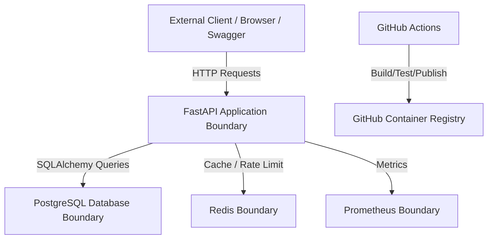

# Threat Model: Amrutam Telemedicine Backend

This document describes the threat model for the Amrutam Telemedicine Backend.

The goal of threat modeling is to identify possible security risks, understand how attackers may misuse the system, and document the controls used to reduce those risks.

The backend handles sensitive workflows such as authentication, doctor availability, consultation booking, prescriptions, payments, and audit logs. Because healthcare data can be sensitive, security is considered across application, database, infrastructure, and CI/CD layers.

---

## 1. System Scope

The threat model covers the following backend components:

* FastAPI application
* PostgreSQL database
* Redis cache/rate-limit store
* JWT authentication
* Role-based access control
* Doctor availability APIs
* Consultation booking APIs
* Prescription APIs
* Payment APIs
* Admin analytics APIs
* Audit log APIs
* Docker Compose infrastructure
* GitHub Actions CI/CD pipeline
* GitHub Container Registry image publishing

---

## 2. Assets to Protect

| Asset                | Description                                               | Sensitivity |
| -------------------- | --------------------------------------------------------- | ----------- |
| User credentials     | Email, phone, password hash                               | High        |
| JWT tokens           | Access tokens used for authenticated APIs                 | High        |
| Patient profile data | Name, phone, DOB, gender, address                         | High        |
| Medical data         | Consultation reason, prescription medicines, doctor notes | Very high   |
| Payment data         | Amount, payment status, provider reference                | High        |
| Doctor data          | Specialization, fee, rating, verification status          | Medium      |
| Audit logs           | User actions, IP address, user agent, resource access     | High        |
| Database credentials | PostgreSQL connection string                              | Critical    |
| JWT secret key       | Used to sign and verify tokens                            | Critical    |
| Docker image         | Deployable backend image                                  | Medium/High |
| CI/CD pipeline       | Controls build, test, and publish flow                    | High        |

---

## 3. Users and Trust Boundaries

## 3.1 Actors

| Actor          | Description                                          |
| -------------- | ---------------------------------------------------- |
| Patient        | Books consultations and views own prescriptions      |
| Doctor         | Creates availability and writes prescriptions        |
| Admin          | Views analytics and audit logs                       |
| Anonymous user | Can register and login                               |
| Attacker       | Tries to misuse APIs, steal data, or disrupt service |
| CI/CD system   | Runs tests, scans, and publishes Docker image        |

---

## 3.2 Trust Boundaries



Main trust boundaries:

1. External client to backend API
2. Backend API to PostgreSQL
3. Backend API to Redis
4. Backend API to Prometheus
5. GitHub Actions to GitHub Container Registry

---

## 4. STRIDE Threat Analysis

STRIDE is used to categorize threats:

```text id="otgss7"
S = Spoofing
T = Tampering
R = Repudiation
I = Information Disclosure
D = Denial of Service
E = Elevation of Privilege
```

---

## 5. Spoofing Threats

Spoofing means pretending to be another user or service.

| Threat                  | Example                            | Impact                      | Mitigation                                                  |
| ----------------------- | ---------------------------------- | --------------------------- | ----------------------------------------------------------- |
| Stolen JWT token        | Attacker uses another user’s token | Unauthorized access         | Token expiry, HTTPS in production, secure storage on client |
| Fake doctor account     | User tries to act as doctor        | Unauthorized doctor actions | RBAC, doctor role checks                                    |
| Fake admin registration | User registers as admin            | Full admin compromise       | Admin self-registration blocked                             |
| Credential stuffing     | Attacker tries many passwords      | Account takeover            | Rate limiting on login                                      |
| Service spoofing        | Fake database/Redis endpoint       | Data compromise             | Environment config, private network in production           |

Implemented controls:

* JWT authentication
* Role-based access control
* Admin self-registration blocked
* Login rate limiting
* Password hashing

Recommended production controls:

* HTTPS/TLS
* MFA
* Short-lived access tokens
* Refresh token rotation
* Device/session management

---

## 6. Tampering Threats

Tampering means modifying data without permission.

| Threat                                          | Example                                | Impact                  | Mitigation                                        |
| ----------------------------------------------- | -------------------------------------- | ----------------------- | ------------------------------------------------- |
| Patient modifies another patient’s prescription | Changing URL ID                        | Privacy breach          | Ownership checks                                  |
| User changes role in request body               | Sends role as ADMIN                    | Privilege misuse        | Admin registration blocked, RBAC                  |
| Slot status manipulation                        | Patient tries to book unavailable slot | Double booking          | Slot status validation                            |
| Duplicate booking writes                        | Client retries same request            | Multiple consultations  | Idempotency key                                   |
| Payment status tampering                        | User tries to mark payment as paid     | Financial inconsistency | Protected payment endpoint                        |
| Audit log tampering                             | User modifies audit history            | Loss of traceability    | Admin-only access, append-only design recommended |

Implemented controls:

* Pydantic validation
* RBAC
* Ownership checks
* Idempotency keys
* Slot availability checks
* Audit logging

Recommended production controls:

* Database-level constraints
* Unique index on `consultations.slot_id`
* Immutable audit log storage
* Request signing for payment webhooks
* Alembic migrations with explicit constraints

---

## 7. Repudiation Threats

Repudiation means a user denies performing an action.

| Threat                     | Example                              | Impact           | Mitigation                       |
| -------------------------- | ------------------------------------ | ---------------- | -------------------------------- |
| Patient denies booking     | “I did not book this consultation”   | Dispute          | Audit logs                       |
| Doctor denies prescription | “I did not create this prescription” | Compliance issue | Audit logs                       |
| Admin denies viewing logs  | Admin misuse                         | Compliance issue | Admin audit events recommended   |
| Payment dispute            | Payment confirmation questioned      | Finance issue    | Payment reference and audit logs |

Implemented controls:

* Audit logs for important actions
* User ID captured
* Resource type captured
* Resource ID captured
* IP address captured
* User agent captured
* Timestamp captured

Recommended production controls:

* Append-only audit log storage
* Centralized logging
* Log retention policy
* Admin activity monitoring
* Digital signatures for critical medical records

---

## 8. Information Disclosure Threats

Information disclosure means sensitive data is exposed to unauthorized users.

| Threat                                      | Example                      | Impact                 | Mitigation                        |
| ------------------------------------------- | ---------------------------- | ---------------------- | --------------------------------- |
| Patient sees another patient’s prescription | ID enumeration               | Medical privacy breach | Ownership checks                  |
| Non-admin sees audit logs                   | Accessing admin endpoint     | Security data leak     | Admin-only RBAC                   |
| JWT secret leaked                           | Tokens can be forged         | Full auth compromise   | Environment variables             |
| Database URL leaked                         | DB compromise                | Critical               | `.env` ignored, secret management |
| Error messages expose internals             | Stack traces visible         | Reconnaissance risk    | Disable debug in production       |
| Metrics expose sensitive labels             | Sensitive info in Prometheus | Data leak              | Avoid sensitive metric labels     |

Implemented controls:

* Protected routes
* RBAC
* Ownership checks
* Environment-based secrets
* `.env` excluded from Git
* Production debug mode configurable

Recommended production controls:

* HTTPS/TLS
* Encryption at rest
* Encrypted backups
* Cloud secret manager
* Disable public API docs if required
* Log redaction
* Least-privilege database user

---

## 9. Denial of Service Threats

Denial of Service means making the system unavailable or slow.

| Threat                  | Example                  | Impact                | Mitigation                     |
| ----------------------- | ------------------------ | --------------------- | ------------------------------ |
| Login brute force       | Many login attempts      | Auth service overload | Rate limiting                  |
| Registration spam       | Many fake accounts       | DB growth             | Register rate limit            |
| Booking spam            | Many booking requests    | Slot/payment overload | Booking rate limit             |
| Expensive doctor search | Large unbounded query    | Slow DB               | Pagination and caching         |
| Redis unavailable       | Cache/rate limit failure | Performance issue     | Fallback design                |
| Database overload       | Too many connections     | Downtime              | Connection pooling recommended |

Implemented controls:

* Rate limiting
* Pagination
* Redis caching
* Docker restart policy
* Health checks
* Prometheus metrics

Recommended production controls:

* Load balancer
* WAF/API gateway
* Autoscaling
* Database connection pooling
* Read replicas
* Queue-based async processing
* Alerting on latency/error rate

---

## 10. Elevation of Privilege Threats

Elevation of privilege means a user gains access beyond their allowed role.

| Threat                              | Example                | Impact               | Mitigation                      |
| ----------------------------------- | ---------------------- | -------------------- | ------------------------------- |
| Patient accesses doctor API         | Creates availability   | Unauthorized action  | Doctor-only RBAC                |
| Doctor accesses admin analytics     | Reads platform metrics | Unauthorized access  | Admin-only RBAC                 |
| Patient accesses other patient data | ID manipulation        | Privacy breach       | Ownership checks                |
| User becomes admin by registration  | Sends role ADMIN       | Full compromise      | Admin self-registration blocked |
| JWT role tampering                  | Modifies token claims  | Privilege escalation | JWT signature verification      |

Implemented controls:

* JWT signature verification
* RBAC dependencies
* Admin self-registration blocked
* Ownership checks
* Protected admin endpoints

Recommended production controls:

* Fine-grained permissions
* Admin approval workflow
* MFA for admin accounts
* Session revocation
* Security event alerts

---

## 11. API-Specific Threats and Controls

## 11.1 Auth APIs

| Endpoint              | Threat                                 | Control                           |
| --------------------- | -------------------------------------- | --------------------------------- |
| `POST /auth/register` | Spam registration, admin self-register | Rate limit, admin block           |
| `POST /auth/login`    | Brute force                            | Rate limit, bcrypt password check |
| `GET /auth/me`        | Unauthorized access                    | JWT required                      |

---

## 11.2 Doctor APIs

| Endpoint                         | Threat                      | Control                  |
| -------------------------------- | --------------------------- | ------------------------ |
| `GET /doctors`                   | Expensive query             | Pagination, caching      |
| `POST /doctors/availability`     | Patient creates doctor slot | Doctor-only RBAC         |
| `GET /doctors/{doctor_id}/slots` | Invalid doctor/slot access  | Validation and filtering |

---

## 11.3 Consultation APIs

| Endpoint                            | Threat                           | Control              |
| ----------------------------------- | -------------------------------- | -------------------- |
| `POST /consultations/book`          | Duplicate booking                | Idempotency key      |
| `POST /consultations/book`          | Double booking                   | Slot status check    |
| `POST /consultations/{id}/start`    | Wrong doctor starts consultation | Role/ownership check |
| `POST /consultations/{id}/complete` | Unauthorized completion          | Role/ownership check |
| `POST /consultations/{id}/cancel`   | Unauthorized cancellation        | Role/ownership check |

---

## 11.4 Prescription APIs

| Endpoint                  | Threat                                     | Control                           |
| ------------------------- | ------------------------------------------ | --------------------------------- |
| `POST /prescriptions`     | Unauthorized prescription creation         | Doctor-only/assigned doctor check |
| `GET /prescriptions/{id}` | Patient reads another patient prescription | Ownership check                   |
| Prescription request body | Invalid medicine data                      | Pydantic validation               |

---

## 11.5 Payment APIs

| Endpoint                           | Threat                       | Control               |
| ---------------------------------- | ---------------------------- | --------------------- |
| `GET /payments/{id}`               | Unauthorized payment access  | Ownership/admin check |
| `POST /payments/{id}/mock-confirm` | Invalid payment state change | Status validation     |

---

## 11.6 Admin APIs

| Endpoint                       | Threat                             | Control         |
| ------------------------------ | ---------------------------------- | --------------- |
| `GET /admin/analytics/summary` | Non-admin reads platform analytics | Admin-only RBAC |
| `GET /admin/audit-logs`        | Audit data leak                    | Admin-only RBAC |

---

## 12. Infrastructure Threats

| Threat                      | Example                     | Impact              | Mitigation                    |
| --------------------------- | --------------------------- | ------------------- | ----------------------------- |
| Exposed database port       | Public access to PostgreSQL | Data breach         | Private network in production |
| Weak container secret       | Default JWT secret used     | Token compromise    | Strong env secret             |
| Vulnerable dependencies     | Outdated package exploited  | Service compromise  | Bandit, pip-audit recommended |
| Compromised Docker image    | Malicious image deployed    | Full compromise     | GHCR, CI checks               |
| Prometheus exposed publicly | Metrics leak                | Reconnaissance risk | Restrict access in production |

Implemented controls:

* Docker Compose internal service network
* Environment-based config
* Bandit security scan
* Published image through GitHub Container Registry
* Health checks

Recommended production controls:

* Private VPC/network
* Non-root Docker user
* Trivy image scanning
* Secret manager
* Firewall rules
* Restrict Prometheus access

---

## 13. CI/CD Threats

| Threat                       | Example               | Impact                | Mitigation                  |
| ---------------------------- | --------------------- | --------------------- | --------------------------- |
| Broken code merged           | No test gate          | Production failure    | CI runs tests               |
| Insecure code merged         | Security issue missed | Vulnerability         | Bandit scan                 |
| Poor code quality            | Lint issues           | Maintainability risk  | Ruff check                  |
| Malicious dependency         | Supply chain attack   | Service compromise    | Dependency scan recommended |
| Compromised publish workflow | Bad image pushed      | Deployment compromise | GitHub Actions permissions  |

Implemented controls:

* Pytest in CI
* Ruff in CI
* Bandit in CI
* Docker image publishing through GHCR
* Minimal GitHub Actions permissions for package publishing

Recommended controls:

* Branch protection
* Required status checks
* Code review
* Dependency vulnerability scanning
* Secret scanning
* Signed Docker images

---

## 14. Risk Matrix

| Risk                    | Likelihood | Impact   | Severity | Status                                                       |
| ----------------------- | ---------- | -------- | -------- | ------------------------------------------------------------ |
| Login brute force       | Medium     | High     | High     | Mitigated with rate limiting                                 |
| Admin self-registration | Medium     | Critical | Critical | Mitigated                                                    |
| Duplicate booking       | High       | High     | High     | Mitigated with idempotency                                   |
| Double booking          | Medium     | High     | High     | Mitigated with slot status checks; DB constraint recommended |
| Patient data leakage    | Medium     | Critical | Critical | Mitigated with RBAC/ownership checks                         |
| JWT secret leak         | Low/Medium | Critical | Critical | Env config used; secret manager recommended                  |
| Database outage         | Medium     | High     | High     | Health checks implemented; backups/failover recommended      |
| Redis outage            | Medium     | Medium   | Medium   | Fallback supported                                           |
| Vulnerable dependency   | Medium     | High     | High     | Bandit implemented; pip-audit recommended                    |
| Metrics exposure        | Low        | Medium   | Medium   | Restrict Prometheus in production                            |

---

## 15. Security Controls Summary

| Control                         | Status                     |
| ------------------------------- | -------------------------- |
| JWT authentication              | Implemented                |
| Password hashing                | Implemented                |
| RBAC                            | Implemented                |
| Admin self-registration blocked | Implemented                |
| Input validation                | Implemented                |
| Rate limiting                   | Implemented                |
| Idempotency key                 | Implemented                |
| Slot availability validation    | Implemented                |
| Audit logging                   | Implemented                |
| Environment variables           | Implemented                |
| Dockerized infrastructure       | Implemented                |
| Prometheus metrics              | Implemented                |
| CI tests                        | Implemented                |
| CI lint                         | Implemented                |
| CI security scan                | Implemented                |
| MFA                             | Planned                    |
| HTTPS/TLS                       | Recommended for production |
| Encrypted backups               | Recommended for production |
| Cloud secret manager            | Recommended for production |
| Container image scanning        | Recommended for production |

---

## 16. Residual Risks

Some risks remain because this is an assignment/demo implementation.

| Residual Risk                                    | Production Recommendation                                          |
| ------------------------------------------------ | ------------------------------------------------------------------ |
| Mock payment confirmation                        | Integrate real payment gateway with webhook signature verification |
| MFA not fully implemented                        | Add OTP/TOTP verification                                          |
| Database constraints not fully migration-managed | Add Alembic migrations                                             |
| Public Swagger docs                              | Disable or restrict in production if needed                        |
| No centralized logs                              | Add ELK/CloudWatch/Grafana Loki                                    |
| No distributed tracing                           | Add OpenTelemetry                                                  |
| No image vulnerability scan                      | Add Trivy                                                          |
| No branch protection documented in repo settings | Enable required CI checks                                          |

---

## 17. Conclusion

The Amrutam Telemedicine Backend includes strong baseline protections for an assignment-level production backend design.

The main implemented protections are JWT authentication, bcrypt password hashing, RBAC, admin self-registration prevention, input validation, rate limiting, idempotency, booking conflict prevention, audit logging, Prometheus metrics, Dockerized infrastructure, CI tests, linting, and Bandit security scanning.

For real production deployment, the most important next steps would be MFA, HTTPS/TLS, encrypted backups, database-level constraints, payment webhook security, centralized logging, vulnerability scanning, and cloud secret management.
